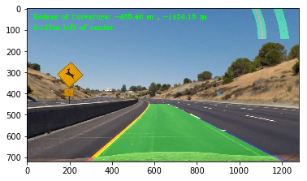
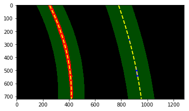

## Advance Lane Line Finding
### Project #2 for Udacity Self-Driving Car Nanodegree

The goals / steps of this project are the following:

* Compute the camera calibration matrix and distortion coefficients given a set of chessboard images.
* Apply a distortion correction to raw images.
* Use color transforms, gradients, etc., to create a thresholded binary image.
* Apply a perspective transform to rectify binary image ("birds-eye view").
* Detect lane pixels and fit to find the lane boundary.
* Determine the curvature of the lane and vehicle position with respect to center.
* Warp the detected lane boundaries back onto the original image.
* Output visual display of the lane boundaries and numerical estimation of lane curvature and vehicle position.

### Camera Calibration
By using OpenCV function `findChessboardCorners` and `calibrateCamera`, I can get the distortion coefficients and camera matrix. These can then be used by the OpenCV `undistort` function to undo the effects of distortion on any image produced by the same camera.

The image below depicts the results of applying `undistort`, using the calibration and distortion coefficients, to one of the chessboard images:

### Pipeline
#### 1. Provide an example of a distortion-corrected image.
To demonstrate this step, I will describe how I apply the distortion correction to one of the test images like this one:

Undistortion can be seen from the difference in the shape of car hood
#### 2. Perspective Transform *(Bird-eye-view)* 
Warp image by using the OpenCV function ` getPerspectiveTransform ` and `warpPerspective`

#### 3.  Create thresholded binary image
I explored several combinations of sobel gradient thresholds and color channel thresholds in multiple color spaces. 
Ultimately, I chose to use just the L channel of the HLS color space to isolate white lines and the B channel of the LAB colorspace to isolate yellow lines. I did not use any gradient thresholds in my pipeline. I did, however finely tune the threshold for each channel to be minimally tolerant to changes in lighting. Below are examples of thresholds in the HLS L channel and the LAB B channel

#### 4. Find polyfit 
In the video, we could predict the position of lane lines by checking previous frame's information. 
searching by following previous lane position could be helpful because difference between previous and current frame is no that dramatic.
In my code, `search_around_poly` function search detected pixels based on previous lane fit polynomial.
if none pixel detected, it uses previous value one more time. 

But we need an other method for a first frame of the video or the previous frame's information being suspicious (such as none pixel detected, etc). To solve with these conditions, I found first window position using histogram. Just accumulated non-zero pixels along the columns in the lower 2/5 of the image.

Then the same window builds up just above and starts searching in same boundary. if some pixels detected, the window moves to the average of the pixels.
This algorithm is implemented in `search_in_sliding_window` .

After the above processes have passed, a polynomial of each lane can be obtained. Then we can calculate curvature and lane center. 
#### 6. Provide an informative image
I fill color between two lane fit polynomials and re_warp this as the original image.

Then add information about lane curvature,lane center difference and bird_eye_view image of polyfit with detected pixels

### Pipeline (video)

### Discussion

After struggling with lane detecting pipelines, I realize the threshold parameter is the most important thing to make my pipeline robust.
But addition of thresholds makes more noise and doesn't really helpful.
After learning more filtering methods, I hope to revisit with some of these strategies in the future.
